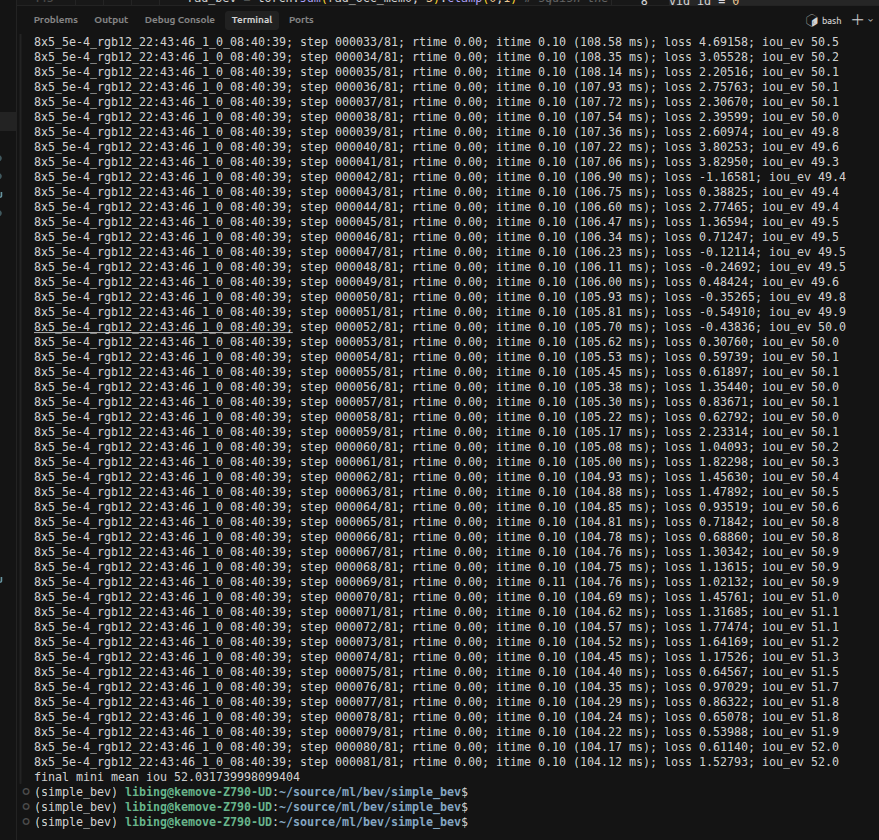

# simple_bev模型架构

Simple-BEV 的模型结构非常简洁，正如其名。根据对代码 (`nets/segnet.py` 和 `utils/vox.py`) 的分析，其核心思想是构建一个固定的 3D 体素空间，将 2D 图像特征投影到该空间中，然后“拍扁”成 BEV 特征进行处理。

以下是 Simple-BEV 模型结构的详细总结：

### 1. 整体架构流程
模型主要由五个部分组成：
**2D 图像编码 (Encoder)** $\rightarrow$ **3D 提升与投影 (Lifting/Projection)** $\rightarrow$ **特征融合 (Fusion)** $\rightarrow$ **BEV 压缩 (BEV Compressor)** $\rightarrow$ **BEV 解码与任务头 (Decoder & Heads)**

### 2. 详细模块解析

#### A. 2D 图像编码 (2D Image Encoder)
- **输入**: 多视角的 RGB 图像。
- **Backbone**: 支持 ResNet (ResNet-101/50) 或 EfficientNet (B0/B4)。
- **特征提取**:
  - 提取图像特征后，使用上采样层 (`UpsamplingConcat`) 将深层特征与浅层特征融合（类似于 FPN 结构），以获得高分辨率且语义丰富的特征图。
  - 最后通过一个 `depth_layer` (1x1 卷积) 将特征通道数调整为 `latent_dim` (默认 128)。
  - **输出**: 每张图像对应一个 2D 特征图。

#### B. 3D 提升 (Lifting / 2D-to-3D Projection)
这是 Simple-BEV 的核心步骤，采用的是**反向投影 (Reverse Projection)** 机制：
- **预定义体素**: 在车辆周围预定义一个固定的 3D 体素网格 (Dimensions: $Z \times Y \times X$)。注意这里的 $Y$ 轴通常代表垂直高度方向，$Z$ 和 $X$ 为地面平面方向。
- **坐标映射**: 计算每个 3D 体素中心在每个相机 2D 图像平面上的投影坐标 $(u, v)$。
- **双线性采样**: 使用 `grid_sample` (双线性插值) 根据投影坐标从对应的 2D 特征图中采样特征。如果投影点落在图像外或相机后方，该体素特征置零。
- **输出**: 每个相机视角都生成一个 3D 特征体 (Feature Volume)。

#### C. 特征融合 (Fusion)
- **聚合**: 将来自所有相机的 3D 特征体进行聚合。Simple-BEV 使用简单的**平均池化 (Mean Pooling)** (忽略无效/被遮挡的区域) 将多视角的特征融合到一个统一的 3D 体素特征中。
- **输出**: 一个统一的 3D 场景特征体，形状为 $(C, Z, Y, X)$。

#### D. BEV 压缩 (BEV Compressor)
- **重塑**: 将 3D 特征体的垂直高度维度 $Y$ 与特征通道维度 $C$ 合并（Stack），形状变为 $(C \times Y, Z, X)$。
- **卷积压缩**: 使用 2D 卷积层 (`Conv2d` + `InstanceNorm` + `GELU`) 将通道数从 $C \times Y$ 降维回 $C$ (`latent_dim`)。
- **作用**: 这一步有效地将 3D 信息“拍扁”到了 BEV 平面 ($Z, X$) 上，同时保留了高度方向的结构信息（通过将高度编码进通道）。
- **多模态融合**: 如果使用 Radar 或 Lidar，它们的占据栅格特征也会在这一步之前拼接到特征体中一起被压缩。

#### E. BEV 解码器 (BEV Decoder)
- **Backbone**: 在 BEV 平面上使用一个类似 **ResNet-18** 的结构作为主干网络。
- **结构**: 包含下采样 (ResNet Layers) 和上采样 (Upsampling Layers) 路径，类似于 U-Net 结构，用于在 BEV 空间提取多尺度特征。
- **输出**: 经过处理的高层 BEV 特征。

#### F. 任务头 (Task Heads)
模型末端接多个简单的卷积头用于最终预测：
1.  **Segmentation Head**: 预测 BEV 语义分割图（如车辆、道路等）。
2.  **Instance Center Head**: 预测物体的中心点热力图。
3.  **Instance Offset Head**: 预测从像素点到物体中心的偏移向量（用于实例聚类）。
4.  **Future Flow Head** (可选): 预测未来的运动流。

### 总结
Simple-BEV 的特点在于其**"Simple"**：它没有使用复杂的 Attention 机制 (如 BEVFormer) 或深度估计网络 (如 LSS)，而是依赖**几何投影**和**3D 卷积压缩**。它证明了只要分辨率和参数量足够，简单的双线性采样加卷积网络就能在 BEV 感知任务上取得很好的效果。

# eval结果复现

# Segnet
`nets/segnet.py` 文件定义了 Simple-BEV 模型的核心网络结构 `Segnet` 及其子模块。这个网络负责从多视角图像输入生成 BEV 下的语义分割、物体中心和偏移量预测。

以下是该文件的详细代码解读：

### 1. 辅助模块
文件开头定义了几个通用的神经网络模块，主要用于特征上采样和融合。
*   `UpsamplingConcat`: 上采样后与 skip connection 的特征进行拼接 (Concat)，然后通过两层卷积融合。这是 U-Net 架构中常见的做法。
*   `UpsamplingAdd`: 上采样后与 skip connection 的特征进行相加 (Add)。这比 Concat 更节省显存和计算量。
*   `Encoder_res101`, `Encoder_res50`, `Encoder_eff`: 定义了多种图像主干网络（Backbone）。
    *   它们都去掉了原始 ResNet/EfficientNet 的最后几层（如 FC 层）。
    *   增加了一个 `upsampling_layer` 将深层特征上采样并与浅层特征融合，增强特征的分辨率。
    *   最后通过 `depth_layer` (1x1 卷积) 将特征通道数统一映射到 `latent_dim` (默认 128)。

### 2. 解码器 (Decoder)
`Decoder` 类负责在 BEV 空间对特征进行解码。它采用了类似 **ResNet-18** 的结构，但针对 BEV 特征进行了调整。
*   **结构**: 包含下采样路径 (`layer1`, `layer2`, `layer3`) 和上采样路径 (`up3_skip`, `up2_skip`, `up1_skip`)，形成 U-Net 结构。
*   **多任务头 (Heads)**: 解码后的特征被送入多个并行的卷积头，用于不同的预测任务：
    *   `feat_head`: 输出高维特征用于可视化或后续处理。
    *   `segmentation_head`: 输出 BEV 语义分割图（例如车辆区域）。
    *   `instance_center_head`: 输出物体中心的热力图 (Sigmoid 激活)。
    *   `instance_offset_head`: 输出像素到物体中心的 2D 偏移向量。
    *   `instance_future_head` (可选): 预测未来的运动流。

### 3. 主模型 (Segnet)
`Segnet` 类将上述组件整合在一起，实现了完整的端到端流程。

#### 初始化 (`__init__`)
*   设置体素网格尺寸 ($Z, Y, X$)。
*   根据配置选择是否使用 Radar/Lidar 数据。
*   初始化 Encoder (`self.encoder`)。
*   **BEV Compressor**: 定义了一个 3D-to-2D 的压缩模块。
    *   它利用 2D 卷积 (`Conv2d`) 将输入的 3D 特征体（其中高度维度 $Y$ 被 flatten 到通道维度）压缩为 BEV 特征。
    *   如果使用 RGB，输入通道数为 `feat2d_dim * Y`。
    *   如果使用 Radar/Lidar，它们的占据特征也会拼接到输入中，增加通道数。
*   初始化 Decoder (`self.decoder`)。
*   预计算 3D 坐标网格 (`self.xyz_camA`) 用于后续的投影操作。

#### 前向传播 (`forward`)
这是模型最核心的部分，流程如下：

1.  **图像编码 (Image Encoding)**:
    *   输入 `rgb_camXs`: $(B, S, 3, H, W)$，其中 $S$ 是相机数量。
    *   对图像进行标准化。
    *   通过 `self.encoder` 提取每张图像的特征 `feat_camXs_`。

2.  **反向投影 (Back-projection / Unprojection)**:
    *   利用 `vox_util.unproject_image_to_mem` 将 2D 图像特征投影到 3D 体素空间。
    *   使用双线性插值 (`grid_sample`) 根据预计算的 3D 点在 2D 图像上的投影坐标采样特征。
    *   这一步生成了每个相机的 3D 特征体 `feat_mems`。

3.  **多视角融合 (Multi-view Fusion)**:
    *   使用 `utils.basic.reduce_masked_mean` 对多相机的 3D 特征体进行平均池化。
    *   只对有效的（投影在图像范围内）体素进行平均，忽略无效区域。
    *   结果是统一的 3D 场景特征 `feat_mem`: $(B, C, Z, Y, X)$。

4.  **数据增强 (随机翻转)**:
    *   如果在训练中开启 `rand_flip`，会对 3D 特征体进行随机的水平翻转（针对 $X$ 轴和 $Y$ 轴方向），增强模型的鲁棒性。

5.  **BEV 压缩 (BEV Compression)**:
    *   将 3D 特征体 `feat_mem` 的高度维度 $Y$ 移到通道维度：$(B, C, Z, Y, X) \rightarrow (B, C \times Y, Z, X)$。
    *   如果有 Radar/Lidar 特征，将其占据网格特征拼接到通道维度。
    *   通过 `self.bev_compressor` 将高维特征压缩回 `latent_dim`，得到 BEV 特征 `feat_bev`。

6.  **BEV 解码 (BEV Decoding)**:
    *   将 `feat_bev` 送入 `self.decoder`。
    *   解码器输出包含分割图 (`seg_e`)、中心点 (`center_e`) 和偏移量 (`offset_e`) 的字典。

7.  **输出**: 返回各个任务头的预测结果。

### 总结
`Segnet` 通过显式的几何投影将 2D 图像特征提升到 3D 空间，然后通过简单的“拍扁”操作（卷积压缩高度维）将其转换为 BEV 特征，最后在 BEV 空间进行常规的分割和检测任务。这种结构简单直观，有效地利用了相机的几何先验信息。

